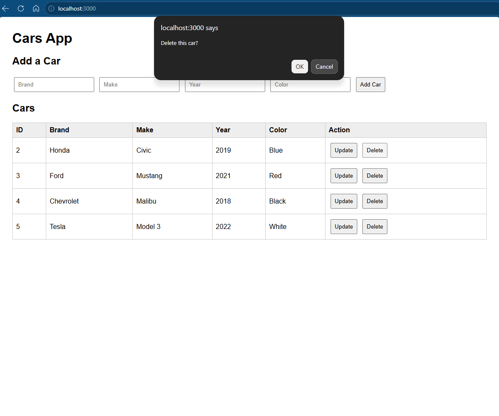
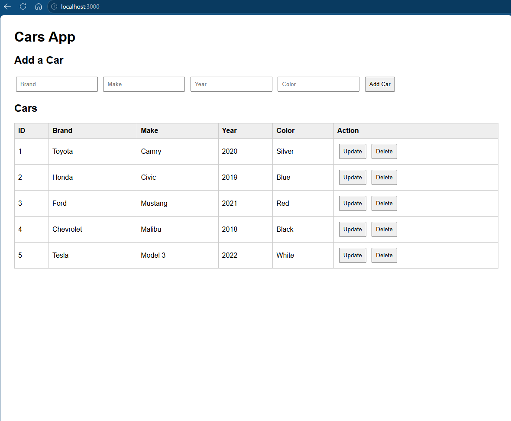
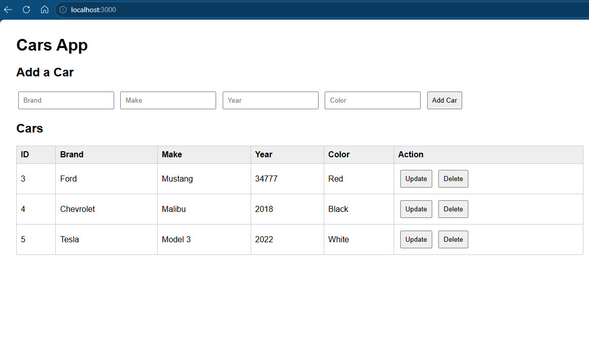

# May6thNodeActivity
For the update I modified the Add Car form to do two things, when an Update button 
is clicked, it fetches that car's dara, fills the inputs, and sends a PUT requesst 
to save the changes.

